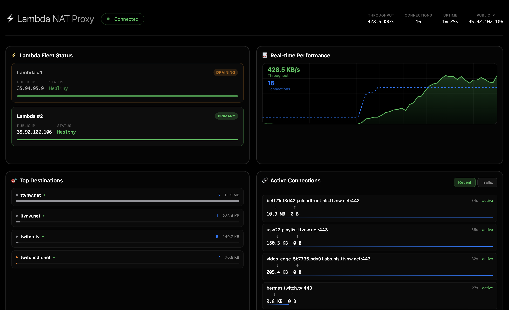

# Lambda NAT Proxy

A serverless proxy implementation that uses NAT hole punching to establish QUIC tunnels through AWS Lambda functions. By coordinating through S3 and using UDP traversal techniques, it creates encrypted proxy connections without requiring any dedicated servers - just Lambda functions that spin up on demand.



## About

This project evolved from exploring an unconventional idea: can AWS Lambda functions work as network proxies? Building on my earlier [awslambdaproxy](https://github.com/dan-v/awslambdaproxy) experiment, this implementation solves the performance and infrastructure challenges using NAT hole punching and QUIC protocol. The result is a serverless proxy that needs no EC2 instances, no SSH tunnels - just Lambda functions and clever networking.

## How It Works

The system uses a three-phase approach to establish NAT traversal:

**1. Coordination Phase**
- Client discovers public IP via STUN protocol
- Writes session info (IP:port, session ID) to S3 bucket
- S3 event notification triggers Lambda function

**2. NAT Hole Punching**
- Both client and Lambda send UDP packets to each other's public endpoints
- Creates bidirectional NAT holes for subsequent traffic
- Uses session ID for packet correlation

**3. QUIC Tunnel Establishment**
- Client starts QUIC server on punched port
- Lambda connects as QUIC client through established hole
- Encrypted, multiplexed tunnel ready for traffic forwarding

**Traffic Flow:**
```
Browser → SOCKS5 → QUIC Tunnel → Lambda → Internet
```

The Lambda function acts as an exit node, forwarding tunneled traffic to destination servers and relaying responses back through the QUIC connection.

## Architecture

```
┌─────────┐   SOCKS5    ┌──────────────┐   QUIC/UDP   ┌─────────┐   HTTP/S   ┌───────────┐
│ Browser │ ──────────  │ lambda-nat-  │ ──────────── │ Lambda  │ ────────── │ Internet  │
│         │ :1080       │ proxy        │              │ Function│            │ Servers   │
└─────────┘             └──────────────┘              └─────────┘            └───────────┘
                              │                            ▲
                              │ session data               │ S3 event
                              ▼                            │
                       ┌─────────────┐                     │
                       │ S3 Bucket   │ ────────────────────┘
                       │ (coord)     │
                       └─────────────┘
```

## Setup

**Prerequisites:**
- AWS CLI configured with Lambda, S3, CloudFormation permissions

**Setup:**
```bash
lambda-nat-proxy config init
```

**Deploy infrastructure:**
```bash
lambda-nat-proxy deploy
```

**Run proxy:**
```bash
lambda-nat-proxy run
```

**Configure browser to use SOCKS5 proxy:** `localhost:1080`

The system auto-detects deployed resources and handles session management automatically.

## Commands

```bash
lambda-nat-proxy config init     # Create configuration file
lambda-nat-proxy deploy          # Deploy AWS infrastructure
lambda-nat-proxy run             # Start SOCKS5 proxy server
lambda-nat-proxy status          # Show deployment status
lambda-nat-proxy destroy         # Remove all AWS resources
```

## Performance Modes

- **test**: 128MB Lambda, 2min timeout (development)
- **normal**: 256MB Lambda, 10min timeout (default)
- **performance**: 512MB Lambda, 15min timeout (high throughput)

## Configuration

Default config location: `~/.config/lambda-nat-proxy/lambda-nat-proxy.yaml`

```yaml
aws:
  region: us-west-2
deployment:
  stack_name: lambda-nat-proxy-a1b2c3d4  # auto-generated unique suffix
  mode: normal
proxy:
  port: 1080
  stun_server: stun.l.google.com:19302
```

## Implementation Details

**NAT Traversal Algorithm:**
1. Client binds UDP socket and performs STUN discovery
2. Client writes session data to S3: `{client_ip, client_port, session_id, timestamp}`
3. S3 notification triggers Lambda function with session data
4. Lambda binds UDP socket and performs STUN discovery  
5. Both endpoints send UDP packets to each other's public address
6. NAT devices create bidirectional port mappings
7. Client starts QUIC server, Lambda connects as client
8. QUIC connection established for traffic forwarding

**Session Management:**
- Unique session IDs prevent collision between concurrent sessions
- S3 lifecycle rules clean up coordination files after 24 hours
- Automatic session rotation when Lambda functions restart

**QUIC Protocol Benefits:**
- Built-in encryption (TLS 1.3)
- Multiplexed streams (no head-of-line blocking)
- Congestion control optimized for varying network conditions

## Building

```bash
make build                    # Build with embedded dashboard
make docker-build             # Build using Docker (no local deps)
make test                     # Run all tests
```